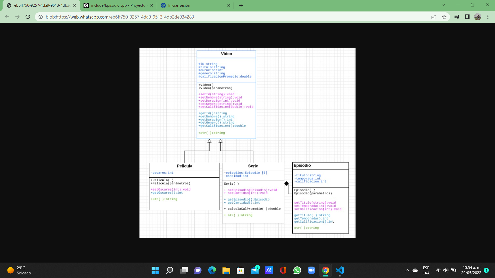

# Cynthia Cristal Quijas Flores
# A01655996
# Avance 3

# UML - Diagrama de clases 

¿Qué aprendiste en este curso, con el desarrollo de la situación problema?

Principalmente me sirvió como repaso de la materia POO que se llevó en primer semestre porque si bien hay temas que se
repitieron como la herencia entre clases, al haber pasado tanto tiempo desde que se vieron considero que era necesario
retomarlos. Por otro lado, hay temas que fueron completamente nuevos para mí al menos como un tema como tal, por ejemplo,
en el caso del poliformismo, clases virtuales y apuntadores, son temas que probablemente los había visto aplicados en 
códigos o videos que había visto en internet, pero no había tenido la oportunidad de entender cómo se aplican y su sintaxis.

¿Qué te dejo  el desarrollo de la evaluación Final?

Desde mi punto de vista, fue una evaluación final retadora en varios aspectos. El primero de todos fue que al mismo tiempo
que se veían los temas de la clase, estos debían ser aplicados en el proyecto, esto me resultó un poco difícil porque había
ocasiones en las que no me quedaban completamente claros los temas y al momento de tener que irlos implementando me confundía.
Sin embargo, al mismo tiempo esto me ponía en la obligación de por mi cuenta continuar repasando los temas para poder responder
los quizes y el proyecto. 
Esta evaluación final me permitió ver una forma de aplicar los temas vistos a un proyecto que puede ser perfectamente algo que
se aplica en la vida real en un trabajo y me resultó entretenido.
